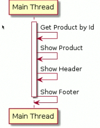
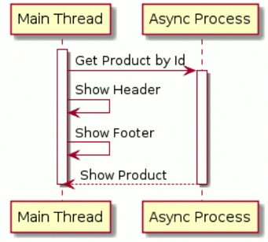
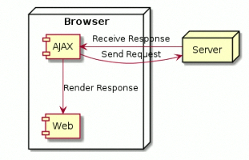
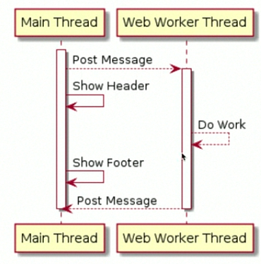

# ASYNCHRONOUS

## Apa itu Synchronous ?

- Program dalam JavaScript secara default akan dieksekusi baris perbaris.
- Secara default, process di JavaScript akan dieksekusi secara **Synchronous**, artinya baris selanjutnya akan dieksekusi setelah baris sebelumnya selesai dikerjakan.
- Process **Synchronous** juga bisa disebut **Blocking**, karena harus menunggu tiap process selesai, baru process selanjutnya bisa dilakukan.

### Contoh Synchronous



## Apa itu Asynchronous ?

- Walaupun secara default process di JavaScript dieksekusi secara **Synchronous**, namun kita bisa memuat menjadi **Asynchronous**.
- Berbeda dengan process **Synchronous**, pada process **Asynchronous**, JavaScript tidak akan menunggu proses tersebut selesai, melainkan JavaScript akan melanjutkan baris selanjutnya, tanpa harus menunggu proses **Asynchronous** selesai.
- Process **Asynchronous** juga disbut **Non-Blocking**.

### Contoh Asynchronous



# Callback

## Apa itu Callback ?

- **Callback**, merupakan mekanisme untuk memanggil kembali kode yang ada di program dari process Async.
- **Callback** biasanya dibuat dalam bentuk function, dan function tersebut akan dieksekusi saat process **Asynchronous** selesai.
- Dengan menggunakan **Callback**, program bisa menerima informasi yang dibutuhkan dari proses yang berjalan secara **Asynchronous**.

### Contoh Async Method

Ada banyak method **Async** yang terdapat di JavaScript, Contoh:

- `setTimeout(handler, time)`, digunakan untuk menjalankan proses **Async** sekali dalam waktu tertentu.
- `setInterval(handler, time)`, digunakan untuk menjalankan proses **Async** secara periodik dalam waktu tertentu.

### setTimeout

```javascript
setTimeout(function() {
	//  do something here
}, 5000) // 5000ms = 5s
```

### setInterval

```javascript
setInterval(function() {
	//  do something here
}, 5000) // 5000ms = 5s
```

# AJAX

## Apa itu AJAX ?

- **AJAX** singkatan dari **Asynchronous JavaScript and XML**.
- **AJAX** dapat digunakan untuk mengambil data dari server halaman web tampil.
- **AJAX** dapat digunakan untuk mengubah tampilan web tanpa harus me-load ulang web.
- **AJAX** dapat mengirim data ke server secara async di background.

## Cara Kerja AJAX



## Membuat AJAX

```javascript
const ajax = new XMLHttpRequest();
ajax.open("Method", "url");
ajax.send();
```

# AJAX Callback

- **AJAX** biasanya digunakan untuk mengirim data ke Server atau menerima data dari Server
- Tiap request **AJAX** yang dilakukan, biasanya kita ingin mendapat informasi response yang diberikan oleh Server.
- Kita tidak bisa langsung mengambil response **AJAX**, karena proses **AJAX** adalah Async, sehingga kita perlu menunggu sampai proses **AJAX** nya selesai.
- Untuk mendapatkan informasi dari AJAX, kita bisa menggunakan **AJAX Callback**, yang akan dieksekusi setelah proses **AJAX** selesai.

## Membuat AJAX Callback

```javascript
const ajax = new XMLHttpRequest();
ajax.onload = () => {
	const response = ajax.responseText;
}
ajax.open("Method", "url");
ajax.send();
```

# AJAX Error Callback

- **AJAX** adalah proses komunikasi Client dan Server.
- Dalam komunikasi Client dan Server, kita tidak tidak bisa selalu menganggap prosess tersebut berjalan dengan lancar.
- Akan ada banyak hal-hal yang bisa mengganggu proses **AJAX** yang bisa menyebabkan error, seperti; koneksi internet bermasalah, error dari server, data dari client tidak valid.
- Hal-hal error seperti ini harus perlu ditangani oleh kode program kita, dan kita bisa menggunakan Error Callback di **AJAX**.

## Membuat AJAX Callback

```javascript
const ajax = new XMLHttpRequest();

ajax.onload = () => {
	if (ajax.status === 200) {
		const response = ajax.responseText;
	} else {
		// error handler here !
	}
}
```

# Dynamic Callback

- Kadang dalam membuat program JavaScript, kita ingin membuat callback yang dinamis.
- Bisa berubah ubah sesuai kebutuhan kita.
- Untuk membuat Dynamic callback, kita bisa memanfaatkan function as agument di JavaScript, dimana callback functionnya kita masukan dalam argument, sehingga bisa diubah sesuai keinginan kita.

# Promise

## Masalah dengan Callback

```javascript
doFirst(data, () =>{
	doSecond(data, () => {
		doThird(data, () => {
			// Callback Hell
		})
	})
})
```

## Apa itu Promise ?

- `promise` merupakan proxy untuk sebuah nilai di masa depan *Future* yang belum diketahui saat pembuatan `promise` tersebut.
- Bisanya `promise` digunakan sebagai proxy untuk proses `async`.
- Penggunaan `promise` sangat mudah, dan lebih mirip dengan kode Synchronous.

## Promise State

+------+---------+--------+--------+
|stete |pending  |fulfiled|rejected|
+------+---------+--------+--------+
|result|undefined|value		|error	 |
+------+---------+--------+--------+

## Membuat Promise

```javascript
const promise = new Promise((resolve, reject) => {
	if (success) {
		resolve(value);
	} else {
		reject(error):
	}
})
```

# Promise Then Method

- Pertanyaannya, bagaimana cara mendapatkan mendapatkan value di `promise` ketika valuenya sudah ada ?
- `promise` memiliki method yang bernama `then` . `then` method ini bisa digunakan sebagai callback ketika value pada promise sudah *resolve*.
- Yang menarik menggunakan `then` method adalah, kita bisa menggunakan *chain method*, sehingga tidak akan terjebak pada *callback hell*.

## Menggunakan Then pada Promise

```javascript
promise
	.then(value => {
		// do something here !
		return value;
	})
	.then(otherValue => {
		// do something here !
		return otherValue;
	})
```

# Promise Catch Method

- Pada **AJAX**, jika terjadi error, kita bisa menggunakan *Error Callback*, bagaimana dengan `promise` ?
- `promise` memiliki method yang bernama `catch`, `catch` method ini digunakan sebagai *Error Callback* yang bisa digunakan seperti `then` method.

## Menggunakan Catch pada Promise

```javascript
promise
	.then(value => {
		// do something here !
		return value;
	})
	.catch(error => {
		// do something here !
		return new Error(error):
	})
```
# Promise Finally Method

- Kadang kita ingin menjalankan kode tertentu, baik itu saat sukses ataupun error.
- Hal ini bisa dilakukan juga di `promise`, menggunakan `finally` method.

## Menggunakan Finally 

```javascript
promise
	.then(value => {
		// do something here !
		return value;
	})
	.finally(() => {
		// do something here !
	})
```

# Promise All Method

- Kadang kita perlu berhadapan dengan beberapa proses Async sekaligus.
- Misal, mengambil detail data produk dari Server pada satu halaman web, dimana satu halaman bisa menampilkan lebih dari satu produk.
- Menggunakan `promise` satu persatu sangatlah menyulitka jika terlalu banyak, tapi untungya `promise` memiliki method `all`.
- `all` method bisa kita gunakan untuk menggabungkan beberapa `promise`, menjadi `promise` baru yang berisi data array hasil `promise` tersebut.

## Menggunakan All pada Promise

```javascript
Promise.all([promise1, promise2, promise...])
	.then(value => {
		// do something with value
	});
```

# Fetch API

- `fetch` API adalah API baru untuk melakukan **AJAX**.
- Tidak seperti AJAX yang menggunakan callback, `fetch` API menggunakan `promise`, sehingga kita bisa mudah menggunakan `fetch` API dibandingkan **AJAX**
- [Fetch API](https://developer.mozilla.org/en-US/docs/Web/API/Fetch_API)

## Menggunakan Fetch API

```javascript
fetch(url, config)
	.then(response => {
		// do something here !
	})
	.catch(error => {
		// do something here !
	})
```

# Async Await

- `async` `await` adalah fitur baru JavaScript yang digunakan untuk mempermudah proses pembuatan code `promise`.
- Dengan menggunakan `async` `await`, kita bisa membuat kode Asynchronous dengan gaya Synchronous.
- `async` digunakan untuk menandakan bahwa function tersebut adalah `async`, dan mengembalikan `pormise`.
- `await` digunakan untuk mendapatkan value hasil dari function yang mengembalikan `pormise`.
- `await` hanya bisa digunakan dalam `async` function.

## Menggunakan Async Await

```javascript
async function onSearch(keyword) {
	const products = await searchProduct(keyword);

	clearProdutcs();
	displayProducts(products):
}
```

# Async Await Error Handler

- Pada Callback dan `promise`, ada mekanisme *Error Handler* yang bisa dilakukan. Bagaimana dengan `async` `await` ?
- Pada `async` `await`, kita bisa menggunakan cara Synchronous untuk menggunakan *Error Handler* nya, yaitu dengan menggunakan `try` `catch` dan `try` `catch` `finally`.

## Menggunakan Try Catch

```javascript
async function onSearch(keyword) {
	try {
		const products = await searchProduct(keyword);

		clearProdutcs();
		displayProducts(products):
	} catch(error) {
		console.error(error.massage);
	} finally {
		console.log('Selesai mengambil data !');
	}
}
```

# Sebelum Belajar Web Worker

- JavaScript adalah Single Thread, artinya walaupun proses yang kita buat adalah `async`, tetapi tetap akan dijalankan dalam thread yang sama.
- Kemampuan satu thread dalam mengelola beberapa pekerjaan, dinamakan Concurrent.
- Kemampuan menjalankan beberapa thread untuk mengelola satu atau lebih pekerjaan, dinamakan paralel.
- Dan untuk membuat proses secara paralel, kita bisa menggunakan Web Worker.

## Web Worker

- **Web Worker** adalah kemampuan yang untuk menjalankan proses di Thread yang berbeda dibanding Main Thread.
- Keuntungan menggunakan **Web Worker** adalah, jika terdapat proses yang membutuhkan waktu lama, Web kita tidak akan *Freeze*, karena proses tersebut bisa kita jalankan di Thread yang berada di *Main Thread* (yang bisa digunakan oleh UI).
- [Web Worker](https://developer.mozilla.org/en-US/docs/Web/API/Web_Workers_API)



# Concurrent VS Parallelism

## Membuat Web Worker

```javascript
const worker = new Worker('file.js');
```

# Web Worker Communication

- **Web Worker** adalah proses `async`, dan untuk berkomunikasi dengan **Web Worker**, kita akan menggunakan Event Listener.
- Untuk mengirim data ke **Web Worker** atau **Main Thread**, kita bisa menggunakan method `postMessange`.

## Web WebWorker Communication (1)

```javascript
const worker = new Worker('file.js');

worker.addEventListerner("mesaage", event => {
	const data = event.data;
})

worker.postMessange(mesaage):
```

## Web Worker Communication (2)

```javascript
// worker-file.js
addEventListerner("message", event => {
	const data = event.data;

	// send back
	postMessange(message);
})
```

## Selanjutnya ?

- RxJS (Reactive Extensions Library for JavaScript)
- Web Socket
- Cara Kerja Non-Blocking

