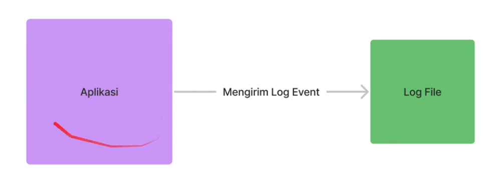

# Logging

## Agenda

- Pengenalan Logging
- Logging Library
- Logger
- Transport
- Format
- Dan lain-lain

## Pengenalan Logging

- Log file adalah file yang berisikan informasi kejadian dari sebuah sistem.
- Biasanya dalam log file, terdapat informasi waktu kejadian dan pesan kejadian.
- Logging adalah aksi menambah informasi log ke log file.
- Logging sudah menjadi standard industri untuk menampilkan informasi yang terjadi di aplikasi yang kita buat.
- Logging bukan hanya untuk menampilkan informasi, kadang digunakan untuk proses debugging ketika terjadi masalah di aplikasi kita.

### Diagram Logging

### Ekosistem Logging

## Logging Library

### NodeJS Logging

- NodeJS sendiri sebenarnya memilih fitur untuk melakukan logging dengan object console.
- Namun saat ini, kebanyakan programmer hanya menggunakan fitur ini pada kasus-kasus yang sederhana.
- Hal ini dikarenakan penggunannya yang kurang flexible dan minim fitur.
- [console]

### Logging Library

Diluar NodeJS Logging, banyak sekali library yang bisa kita gunakan untuk logging, seperti :

- [Winston](https://npmjs.com/package/winston)
- [Bunyan](https://npmjs.com/package/bunyan)
- [Pino](https://npmjs.com/package/pino)
- [LogLevel](https://npmjs.com/package/loglevel)
- [NPMLog](https://www.npmjs.com/package/npmlog)

### Winston

- Pada kelas ini kita akan menggunakan Winston
- Winston merupakan logging library yang sangat populer di kalangan programmer NodeJS.
- [Winston](https://npmjs.com/package/winston)
- [Githu Winston](https://github.com/winstonjs/winston)

##
