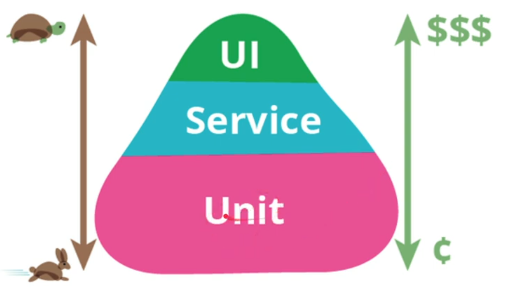
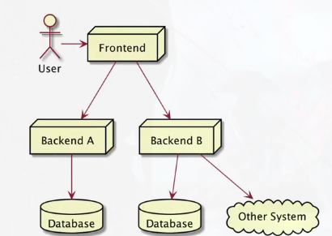

# Unit Test

## Sebelum Belajar

- Mengikuti Kelas JavaScript Programer Zaman Now.
- NodeJS Dasar.
- NodeJS Package Manager.

## Agenda

- Pengenalan Testing.
- Berkenalan dengan Jest Library.
- Membuat Unit Test.
- Matchers.
- Mock.
- Dan lain-lain.

## Pengenalan Software Testing

- Software testing adalah salah satu disiplin ilmu dalam software enginerring.
- Tujuan utama dari software testing adalah memastikan kualitas kode aplikasi kita baik.
- Ilmu untuk software testing sendiri sangatlah luas, pada materi ini kita hanya akan fokus ke unit testing.

### Test Pyramid



### Contoh High Level Architecture Aplikasi



### UI Test / End to End Test


### Service Test / Intergation Test


### Contoh Internal Architecture Aplikasi


### Unit Test


- Unit test akan fokus menguji bagian kode program terkecil, biasanya menguji sebuah method.
- Unit test biasanya dibuat kecil dan cepat, oleh karena itu biasanya kadang kode unit test lebih kecil banyak dari kode program aslinya, karena semua skenario pengujian akan dicoba di unit test.
- Unit test bisa digunakan sebagai cara untuk meningkatkan kualitas kode program kita.

## Pengenalan Jest

### NodeJS Assertion Package

- NodeJS sendiri sebenarnya memiliki package untuk melakukan assertion, namun kita tidak akan membahasnya, karena jarang sesekali orang menggunakan package tersebut.
- [assert](http://https://nodejs.org/api/assert.html)
- Programer NodeJs kebanyakan menggunakan library yang lebih baik untuk melakukan unit test.

### NodeJS Unit Test Library

Sebenarnya ada banyak sekali library open source yang bisa kita gunakan untuk melakukan unit test di NodeJS.

- [Jest](https://jestjs.io/)
- [Mocha](https://mochajs.org/)
- [Jascmine](https://jasmine.github.io/)
- Dan masih banyak yang lainnya.

### Pengenalan Jest

- Jest adalah sebuah satu library untuk test NodeJS yang sangat populer.
- Jest sendiri dibuat oleh Facebook.
- Jest terintegrasi sangat baik dengan banyak teknologi seperti NodeJS, ReactJS, VueJS, dan lain-lain.
- Jest fokus pada kesederhanakan, sehingga penggunannya sangat mudah untuk pemula yang ingin mencoba unit test.
- [jestjs](https://jestjs.io/)

## Membuat Project

```sh
npm init
```

## Menginstall Jest

- Jest digunakan untuk membuat unit test saja, sehingga kita tidak perlu menambahkan sebagai dependency production.
- Kita cukup tambahkan sebagai development dependency.
- Kita bisa tambahkan di package.json atau gunakan printah :

```sh
npm install jest --save-dev
```

- [npmjs](https://npmjs.com/package/jest)

### Kode : package.json

```json
{
	"name": "belajar-unit-test",
	"version": "1.0.0",
	"description": "Belajar NodeJS Unit Test",
	"main": "./src/index.js",
	"scripts": {
		"test": "echo \"Error: no test specified\" && exit 1"
	},
	"devDependencies": {
		"jest": "^28.1.0"
	},
	"type": "module",
	"author": "Yusril Arzaqi",
	"license": "MIT"
}
```

### Program Jest


### Menjalankan Unit Test

- Untuk menjalankan unit test menggunakan Jest, kita bisa jalankan jest yang ada di `node_module/.bin/jest`.
- Tapi kita bisa menggunakan script di package, cukup ketikan kode prgoram nya saja di bagian script test.

### Kode : package.json

```json
{
  "name": "belajar-unit-test",
  "version": "1.0.0",
  "description": "",
  "main": "./src/index.js",
  "scripts": {
    "test": "echo \"Error: no test specified\" && exit 1"
  },
  "type": "module",
  "author": "Yusril Arzaqi",
  "license": "MIT",
  "devDependencies": {
    "jest": "^28.1.3"
  }
}
{
  "name": "belajar-unit-test",
  "version": "1.0.0",
  "description": "",
  "main": "./src/index.js",
  "scripts": {
    "test": "jest"
  },
  "type": "module",
  "author": "Yusril Arzaqi",
  "license": "MIT",
  "devDependencies": {
    "jest": "^28.1.3"
  }
}
```

### NPX

- Menjalankan perintah jest lumayan ribet karena kita harus selalu menjalankan memlalui folder `node_module/.bin/`.
- Untungnya, di NodeJS terdapat program bernama NPX (Node Package Runner).
- NPX ini digunakan spesial untuk menjalankan perintah yang bisa secara otomatis mendeteksi file yang terdapat di `node_module/.bin/`.
- Jadi untuk menjalankan Jest, kita bisa menggunakan perintah :

```sh
npx jest
```

## Membuat Unit Test

- Jest sudah menyediakan function yang diregistrasikan secara global bernama `test()`, function tesebut digunakan untuk membuat unit test.
- `test()` memiliki parameter nama unit test dan juga function yang berisi kode unit test nya.

### Kode : Sum Function

```javascript
export const sum = (first, second) => {
	return first + second;
};
```

### Kode : Test Sum Function

```javascript
import { sum } from '../src/sum';

test('sum(1, 2) must be 3', () => {
	const result = sum(1, 2);

	expect(result).toBe(3);
});
```

### Kekurangan Jest

- Sejak awal belajar NodeJS, kita selalu melakukan JavaScript Modules.
- Sayangnya, Jest sampai dibuatnya materi ini, belum mendukung JavaScript Modules, masih menggunakan cara lama menggunakan CommonJS dengan memanfaatkan function `require()`.
- Untungnya, ada library bernama Babel, yang bisa kita gunakan untuk membantu Jest.

### Jest Code Transformation

- Jest mendukung code transformation, yaitu fitur dimana kita bisa melakukan pengubahan kode program sebelum dijalankkan oleh Jest.
- Fitur ini yang dimanfaatkan untuk melakukan ke kode JavaScript yang bisa dimengerti oleh Jest, memanfaatkan library Babel.
- [Code Transformation](https://jestjs.io/docs/code-transformation)

### Babel

- Babel adalah JavaScript Compiler, yang digunakan untuk melakukan kompilasi kode JavaScript ke kode JavaScript yang berbeda versi, biasanya untuk ke versi yang lebih lama agar kompatibel dengan Browser versi lama.
- Dengan Babel, kita bisa membuat kode program dengan fitur JavaScript terbaru, seperti Modules, tapi bisa di compile menjadi JavaScript lebih sehingga compatible ketika dijalankan oleh teknologi lama atau yang belum mendukung fitur JavaScript baru.
- [babeljs](https://babeljs.io/)

### Integrasi Babel dan Jest

- Jest terintegrasi dengan baik dengan Babel, sehingga Jest bisa secara otomatis melakukan kompilasi kode JavaScript unit test kita dengan Babel, dan menjalankan kode JavaScript dengan versi yang kompatibel dengan Jest.
- [setup](https://babeljs.io/setup)

### Jest Configuration

- Jest memiliki banyak konfigurasi, namun jika kita tidak ubah konfigurasinya, Jest sudah memiliki default konfigurasi.
- Ada banyak sekali konfigurasi yang terdapat di Jest, kita akan bahas sambil berjalan, dan yang memang diperlukan saja.

### File Konfigurasi Jest

- Jest sendiri mendukung dua cara untuk menyimpan data konfigurasi.
- Pertama, menyimpan di file package.json dengan key jest.
- Kedua dengan menyimpan sebagai file JavaScript di file `jest.config.[js/ts/mjs]`, atau membuatnya secara otomatis dengan peintah :

```sh
jest --init
```

- Jika menggunakan konfigurasi menggunakan file `jest.config.[js/ts/mjs]`, jangan lupa untuk memindahkan konfigurasi Jest di package.json.

### Pengaturan Konfigurasi

- Konfigurasi di Jest sederhana, cukup gunakan key-value.
- Dimana kita bisa melihat semua konfigurasi key yang tersedia dan kegunaannya di halaman [Jest Configuration](https://jestjs.io/docs/configuration)

### Jest Command Line Interface

- Seperti yang sudah dibahas sebelumnya, saat kita menginstall dependency Jest ke project kita, terdapat file jest di folder `node_module/.bin`.
- Dan untuk menjalankan unit test, kita bisa gunakan program jest.
- Jest sendiri sebenarnya banyak sekali perintah tambahannya, dan kadang kita perlu memanfaatkannya, jadi tidak hanya banyak sekali perintah tambahannya, dan kadang kita perlu memanfaatkannya, jadi tidak hanya mengetikkan perintah jest saja.
- Untuk melihat detail perintah apa saja yang bisa kita gunakan, silahkan gunakan perintah :

```sh
jest --help
```

### Kode : Run Test by Path

```sh
npx jest --runTestsByPath test/sum.test.js
```

## Matchers

- Saat kita membuat unit test, hal yang dilakukan adalah kita biasanya memiliki ekspektasi.
- Contoh pada kode `sum()` sebelumnya, ketika kita panggil function `sum()` dengan parameter 1 dan 2, ekspektasi kita adalah hasil return dari function `sum()` tersebut adalah 3.
- Di Jest, hal ini dinamakan Matchers.
- [Matchers](https://jestjs.io/docs/using-matchers)

### Expect Function

- Matchers di Jest direpresentasikan dalam sebuah function bernama expect (value).
- Function `expect()` mengembalikan object Matchers, yang bisa kita gunakan untuk mengetest value yang kita `expect()`.
- Ada banyak sekali function untuk melakukan test di Matchers, kita bisa baca detail nya di halaman dokumentasi API untuk function `expect()`.
- [documentasi expect](https://jestjs.io/docs/expect)

## Equal Matchers

- Salah satu Matchers yang biasa digunakan ketika membuat unit test adalah equal matchers.
- Ini digunakan untuk memastikan bahwa data sesuai atau sama dengan exspetasi kita.

### Equal Matchers Functions

| Function                        | Keterangan                                                                                                            |
| ------------------------------- | --------------------------------------------------------------------------------------------------------------------- |
| expect(value).toBe(expected)    | Value sama dengan expected, biasanya digunakan untuk value bukan object                                               |
| expect(value).toEqual(expected) | Value sama dengan expected, dimana membandingkan semua properties secara recursive, atau dikenal dengan deep equality |

### Kode : Equals Matchers

```javascript
test('test toBe', () => {
	const name = 'Yusril ';
	const hello = `Hello ${name}`;

	expect(hello).toBe('Hello Yusril');
});

test('test toEqual', () => {
	const person = {
		id: '185512',
	};
	Object.assign(person, { name: 'Yusril' });
	expect(person).toEqual({ id: '185512', name: 'Yusril' });
});
```

## Truthiness Matchers

- Dalam unit test, kadang kita ingin membedakan antara undefined, null dan false.
- Dan kadang kita ingin melakukan expektasi nilai tersebut.
- Jest memiliki matcher untuk melakukan hal tersebut juga.

### Truthiness Matchers Function

|            Function             |                               Keterangan                               |
| :-----------------------------: | :--------------------------------------------------------------------: |
|   `expect(value).toBeNull()`    |                     Memastikan value adalah `null`                     |
| `expect(value).toBeUndefined()` |                  Memastikan value adalah `undefined`                   |
| `expect(value).toBeUndefined()` |                  Memastikan value adalah `undefined`                   |
|  `expect(value).toBeTruthy()`   | Memastikan value bernilai apapu, asal if statement mengganggap `true`  |
|   `expect(value).toBeFalsy()`   | Memastikan value bernilai apapu, asal if statement mengganggap `false` |

### Kode : Truthiness Matchers

```javascript
test('truthiness', () => {
	let value = null;
	expect(value).toBeNull();
	expect(value).toBeDefined();
	expect(value).toBeFalsy();

	value = undefined;
	expect(value).toBeUndefined();
	expect(value).toBeFalsy();

	value = 'Yusril';
	expect(value).toBeTruthy();
	expect(value).toBe('Yusril');
});
```

### Numbers Matchers

- Jest juga memiliki matcher untuk digunakan untuk value berupa number.
- Ketika value berupa number, kita juga bisa menggunakan `toBe()` dan `toEqual()`, untuk memastikan bahwa nilai number bernilai sama dengan expected.

### Numbers Matcher Function

|           Function           |                   Keterangan                    |
| :--------------------------: | :---------------------------------------------: |
|    `.toBeGreaterThan(n)`     |       Memastikan value lebih beasr dari n       |
| `.toBeGreaterThanOrEqual(n)` | Memastikan value lebih besar atau sama dengan n |
|      `.toBeLessThan(n)`      |       Memastikan value lebih kecil dari n       |
|  `.toBeLessThanOrEqual(n)`   | Memastikan value lebih kecil atau sama dengan n |

## String Matcher

- Jest juga memiliki matcher function yang digunakan untuk value berupa String.
- Jika kita ingin memastikan sebuah string sama, kita bisa menggunakan `toBe()` atau `toEqual()`.

### String Matcher Functions

|     Function     |              Keterangan              |
| :--------------: | :----------------------------------: |
| `toMatch(regex)` | Memastikan value sesuai dengan regex |

### Kode : String Matcher

```javascript
test('string', () => {
	const name = 'Yusril Arzaqi';

	expect(name).toBe('Yusril Arzaqi');
	expect(name).toEqual('Yusril Arzaqi');
	expect(name).toMatch(/zaqi/);
});
```

## Arrays Matcher

- Jest juga memiliki function yang bisa kita gunakan untuk mengecek data di dalam sebuah value.
- Jika ingin memastikan bahwa array sama, kita bisa menggunakan `toEqual()`.

### Arrays Matcher

|        Function         |                                      Keterangan                                      |
| :---------------------: | :----------------------------------------------------------------------------------: |
|   `.toContain(item)`    |  Memastikan value array memiliki item, dimana pengecekan item menggunakan `toBe()`   |
| `.toContainEqual(item)` | Memastikan value array memiliki item, dimana pengecekan item menggunakan `toEqual()` |

### Kode : Arrays Matchers

```javascript
describe('Arrays Testing', () => {
	test('array', () => {
		const names = ['Yusril', 'Arzaqi'];
		expect(names).toContain('Arzaqi');
		expect(names).toEqual(['Yusril', 'Arzaqi']);
	});

	test('array object', () => {
		const persons = [
			{
				name: 'Yusril',
			},
			{
				name: 'Arzaqi',
			},
		];
		expect(persons).toContainEqual({ name: 'Arzaqi' });
		expect(persons).toEqual([
			{
				name: 'Yusril',
			},
			{
				name: 'Arzaqi',
			},
		]);
	});
});
```

## Exceptions Matchers

- Saat membuat kode program, kadang kita sering membuat exception.
- Dalam unit test pun, kadang kita berharap sebuah exception terjadi.
- Jest juga memiliki matchers untuk melakukan pengecekan exception.
- Khusus untuk jenis matchers exception, kita perlu menggunakan closure function di value `except()` nya, hal ini untuk memastikan exception ditangkap oleh matchers, jika tidak menggunakan closure function, maka exception akan terlanjur terjadi sebuah terjadi sebelum kita memanggil `except()` function.

### Exceptions Matchers Functions

|       Function       |                          Keterangan                           |
| :------------------: | :-----------------------------------------------------------: |
|     `.toThrow()`     |              Memastikan terjadi exception apapun              |
| `toThrow(exception)` | Memastikan terjadi exception sesuai dengan expected exception |
| `.toThrow(message)`  |   Memastikan terjadi exception sesuai dengan string message   |

### Kode : Exceptions Matchers

```javascript
export class MyException extends Error {}

export function callMe(name) {
	if (name === 'Yusril') {
		throw new MyException('Ups my exception happens');
	} else {
		return 'OK';
	}
}
```

```javascript
import { callMe, MyException } from '../src/exception';

test('Exception', () => {
	expect(() => callMe('Yusril')).toThrow();
	expect(() => callMe('Yusril')).toThrow(MyException);
	expect(() => callMe('Yusril')).toThrow('Ups my exception happens');
});
```

## Not Matchers

- Saat melakukan pengecekan menggunakan matchers, kadang-kadang kita ingin melakukan pengecekan kebalikannya.
- Misal tidak sama dengan, tidak lebih dari, tidak contains, dan lain-lain.
- Jest memiliki fitur untuk melakukan "not" di Matchers nya, dengan menggunakan property not di matchers, secara otomatis kita akan melakukakn pengecekan kebalikannya.
- Semua jenis matchers yang sudah kita bahas, mendukung property not ini.

### Kode : Not Matchers

```javascript
describe('Not Matchers', () => {
	test('String not', () => {
		const name = 'Yusril Arzaqi';

		expect(name).not.toBe('Bimo');
		expect(name).not.toEqual('Dimas');
		expect(name).not.toMatch(/Adam/);
	});

	test('Numbers Not', () => {
		const value = 2 + 2;

		expect(value).not.toBeGreaterThan(6);
		expect(value).not.toBeLessThan(2);
		expect(value).not.toBe(10);
	});
});
```

## Test Async Code

- Saat membuat kode program JavaScript, penggunaan kode asynchronous pasti sering kita gunakan, baik itu menggunakan `Promise` atau menggunakan `async` `await`.
- Jest terintegrasi dengan baik jika kita ingin melakukan pengetesan terhadap kode yang `async`.
- Namun saat kita melakukan pengetesan kode `aysnc`, kita harus memberi tahu ke Jest, hal ini agar Jest tahu dan bisa menggunakan kode `async` nya, sebelum melanjutkan ke unit test selanjutnya.
- Cara sebenarnya sangat mudah, kita cukup gunakan `async` code di closure function Jest.

### Kode : Async Function

```javascript
export const sayHelloAysnc = (name) => {
	return new Promise((resolve, reject) => {
		setTimeout(() => [
			name ? resolve(`Hello ${name}`) : reject('Name is empty'),
		]);
	}, 1000);
};
```

### Kode : Test Async Function

```javascript
import { sayHelloAysnc } from '../src/async';

test('Async Test', async () => {
	const result = await sayHelloAysnc('Yusril');
	console.log(result);
	expect(result).toBe('Hello Yusril');
});
```

### Error : Regenerator Runtime

```
Test suite failed to run

RefrenceError : regeneratorRuntime is not defined
```

### Regenerator Runtime Error

- Jangan khawatir jika terjadi regenerator runtime error.
- Ini adalah error yang terjadi di Babel, hal ini secara default Babel tidak memiliki melakukan memiliki fitur untuk melakukan kompilasi runtime ketika menemukan fitur egenerator atau `async` function.
- Kita bisa menambahkan plugin untuk transform dan regenerator dengan menambahkan dependency :

```sh
npm install @babel/plugin-transform-runtime --save-dev
```

- selanjutnya tambahkan di `babel.config.json`

### Kode : Babel Config

```json
{
	"presets": ["@babel/preset-env"],
	"plugin": [
		[
			"@babel/plugin-transorm-runtim",
			{
				"regenerator": true
			}
		]
	]
}
```

### Async Matchers

- Sebelumnya kita menggunakan `async` `await` await untuk melakukan matchers, sebenarnya Jest juga memiliki fitur matchers terhadap data `aysnc` atau `Promise`.
- Hal ini mempermudah kita ketika ingin melakukan mathers, sehingga tidak perlu melakukan `await` pada `async` functionnya.
- Semua Async Matchers mengembalikan Promise.

### Async Matchers Functions

|          Function          |                                          Keterangan                                          |
| :------------------------: | :------------------------------------------------------------------------------------------: |
| `expect(promise).resolves` | Expektasi bahwa promise sukses, dan selanjutnya bisa kita gunakan Matchers function lainnya. |
| `expect(promise).rejects`  | Expektasi bahwa promise gagal, dan sejanjutnya kita bisa gunakan Matchers function lainnya.  |

### Kode : Async Matchers Functions

```javascript

```
