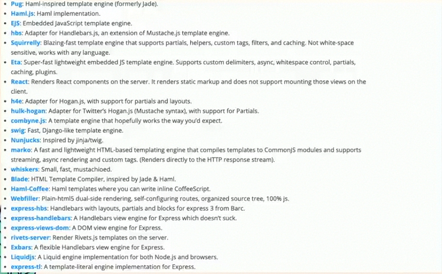

# Express JS

> Fast, unopinionated, minimalist web framework for **NodeJS**

- Web app Framework yang dibuat di atas NodeJS
- Menyesiakan antarmuka yang minimal untuk kakas yang diperlukan untuk membuat aplikasi web
- Membantu pengelolaan aliran data dari server ke aplikasi
- MERN, MEAN, MEVN Stack (MongoDB, ExpressJs, React|Angular|Vue, NodeJS)
- Diciptakan oleh TJ Holowaychunk, pada tanggal 22 Mei 2010

## Fitur ExpressJs

- Menangani request dengan berbagai metode HTTP dengan mudah (Routes).
- MVC (Model-View-Controller).
- Terintegrasi dengan "view" *rendering engine*, untuk mengelola *template*
- *middleware*

## Unopinionated

- Tidak ada aturan baku untuk membuat sesuatu
- Flexibel
- Menentukan sendiri struktur aplikasi
- Bongkar pasang middleware

## Templating Engine



## Database

- Cassandra
- Couchbase
- LevelDB
- MySQL
- MongoDB
- Neo4j
- Oracle
- PostgreSQL
- Redis
- SQL Server
- SQLite
- Elasticsearch

## Menggunakan ExpressJS

```javascript
const express = require('express');
const app = express();
const port = 3000;

app.get('/'. (req, res) => {
  res.send('Hello world');
});

app.listen(port, () =>{
  console.log(`Example app listening at http://localhost:${port}`);
});
```

