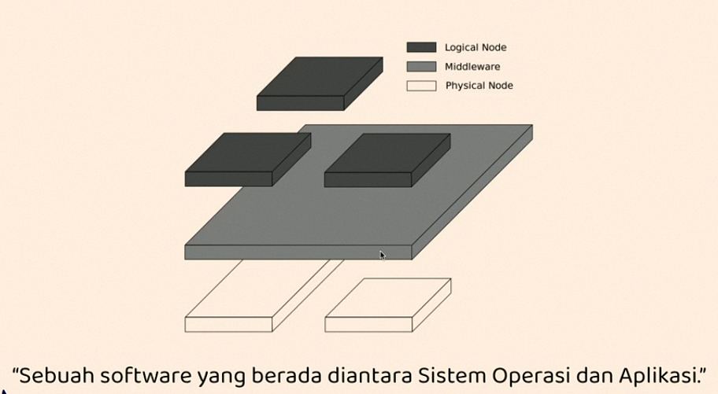

# Middleware

> Sebuah softawre yang menghubungkan softawre atatu aplikasi lain

- Database
- Web Server
- Game Engine
- Web Application

## Express Middleware

> Aplikasi Express itu sebenarnya berisi serangkaian pemanggilan fungsi middleware

- User-defined middleware
  * Application-level middleware
  * Router-level middleware
  * Error-handling middleware
- Builtt-in middleware
- Third-party middleware

## Fungsi Middleware

> Sebuah fungsi yang memiliki akses ke object request **(req)**, object response **(res)**, dan fungsi middleware berikutnya **(next)**.

