# Object Oriented Programming - Programming Jaman Now

## Apa itu object Oriented Programming?

- Object Oriented Programming adalah sudut pandang bahasa pemrograman yang berkonsep **OBJEK**.
- Ada banyak sudut pandang bahasa pemrograman, namun OOP adalah yang sangat populer saat ini.
- Ada beberapa istilah yang perlu dimengerti dalam OOP, yaitu:Object dan Calss.

## Apa itu Object?

- **Object** adalah data yang berisi field / properties / attributes dan method / function / behavior

## Apa itu Class?

- **Class** adalah blueprint, prototype atau cetakan untuk membuat Object.
- Class berisikan deklarasi semua properties dan functions yang dimiliki oleh Object.
- Setiap Object selalu dibuat dari Class.
- Dan sebuah Class bisa membuat Object tanpa batas.

## Class dan Object : Person

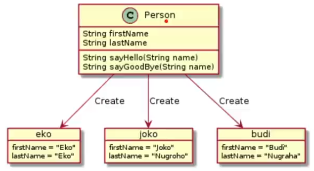

## Class dan Object : Car

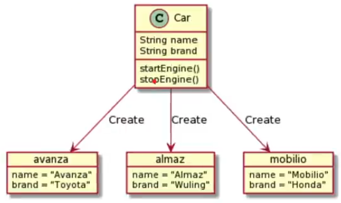

## OOP di JavaScript

- **JavaScript** sendiri sebenarnya sejak awal dibuat sebagai bahasa pemrograman prosedural, bukan bahasa pemrograman berorientasi objek.
- Oleh karena, implementasi OOP di JavaScript memang tidak sedetail bahasa pemrograman lain yang memang dari awal merupakan bahasa pemrograman OOP seperti Java atau C++.

## Membuat Constructor Function

### Membuat Object

- Sebenarnya kita sudah belajar tipe data object, dengan cara membuat variable dengan tipe data object,
- Namun pembuatan object menggunakan tipe data object, akan membuat object yang selalu unik, sedangkan dalam OOP, biasanya kita akan membuat class seperti cetakan, sehingga bisa membuat object dengan karakteristik yang sama berkali-kali, tanpa harus mengdeklarasikan object berkali-kali seperti menggunakan tipe data object.

### Kode : Membuat Object dengan Object

```javascript
const eko = {
  firstName : "Eko",
  lastName : "Khanndy"
};
const yusril = {
  firstName : "Yusril",
  lastName : "Arzaqi"
}
```

### Membuat Constructor Function

- Sebelum EcmaScript versi 6, pembuatan class, biasanya menggunakan function. Hal ini dikarenakan sebenarnya JavaScript bukanlah bahasa pemrograman yang fokus ke OOP.
- Untuk menggunakan class di JavaScript lama, kita bisa menggunakan function.
- Function ini kita sebut dengan Constructor Function.

### Kode : Constructor Function

```javascript
function Person() {
  //kode
}
```

### Membuat Object dari Constructor Function

- Setelah kita membuat class, jika kita ingin membuat object dari class tersebut, kita bisa menggunakan kata kunci `new`, lalu diikuti dengan nama constructor function tersebut.

### Kode : Membuat Object

```javascript
function Person() {

}

const eko = new Person();
const yusril = new Person();
```

### Property di Constructor Function

- Sebenarnya setelah kita membuat object, kita bisa dengan mudah menambahkan property ke dalam object tersebut hanya dengan menggunakan nama variable nya, diikuti tanda titik dan nama property.
- Namun jika seperti itu, alhasil, constructor function yang sudah kita buat tidak terlalu berguna, karena property nya hanya ada di object yang kita tambahkan property.
- Untuk menambahkan property didalam semua object yang dibuat dari constructor function, kita bisa menggunakan kata kunci `this` lalu diikuti dengan nama property nya.

### Kode : Property di Constructor Function

```javascript
function Person() {
  this.firstName = ""
  this.lastName = ""
}

const eko = new Person();
const yusril = new Person();
```

## Method di Constructor Function

- Sama seperti pada tipe data object biasanya, kita juga bisa menambahkan method di dalam function.
- Jika kita tambahkan method di constructor function, secara otomatis object yang dibuat akan memiliki method tersebut.

### kode : Method di Constructor Function

```javascript
function Person() {
  this.firstName = ""
  this.lastName = ""
  this.sayHello = function (name) {
    console.info('Hello ${name}, my name is ${this.firstName}');
  }
}
```

## Parameter di Constructor Function

- Karena dalam JavaScript, class adalah berbentuk function, jadi secara default, function tersebut bisa memiliki parameter.
- Constructor function sama seperti function biasanya, bisa memiliki parameter, hal ini membuat kita membuat object, kita bisa menggirim langsung data lewat parameter di constructor function tersebut.

### Kode : Parameter di Constructor Function

```javascript
function Person(firstName, lastName) {
  this.firstName = firstName;
  this.lastName = lastName;
  this.sayHello = function (name) {
    console.info(`Hello ${name}, my name is ${this.firstName}`);
  }
}
```

## Constructor Inheritance

- Dalam constructor kita biasanya membuat property baik itu berisi value atau pun function.
- Di dalam constructor, kita bisa memanggil constructor lain, dengan begitu kita bisa mewarisi semua property yang dibuat di constructor lain tersebut.
- Untuk memanggil constructor lain, kita bisa menggunakan `NamaCosntructor.call(this, parameter)`

### Kode : Constructor Inheritance

```javascript
function Employee(firstName) {
  this.firstName = firstName;
  this.sayHello = function (name) {
    console.info(`Hello ${name}, my name is ${this.firstName}`);
  }
}

function Manager (firstName, lastName) {
  Employee.call(this, firstName)
  this.lastName = lastName;
}
```

## Prototype

- JavaScript sebelumnya dikenal dengan pemrograman berbasis prototype.
- Memang agak sedikit membingungkan, dan tidak dipungkiri, banyak sekali yang bingung dengan konsep prototype di JavaScript.
- Pada chapter ini, kita akan bahas tentang konsep prototype.

### Prototype Inheritance

- Saat kira membuat object dari constructor function, object tersebut disebut instance, semua property (baik itu value atau method), akan berada di dalam instance object nya.
- Setiap kita membuat sebuah constructor function, maka secara otomatis akan dibuatkan prototype nya, misal ketika kita membuat constructor function `Person`, maka akan ada `Person.prototype`.
- Saat kita membuat sebuah object instance, secara otomatis object tersebut adalah turunan dari `Constructor.prototype` nya.
- Untuk mengakses prototype milih sebuah instance, kita bisa menggunakan `__proto__`.

```javascript
const eko = new Person("Eko", "Khanndy");
const yusril = new Person("Yusril", "Arzaqi");

console.info(eko);
console.info(yusril);
```

### Console : Object Instance

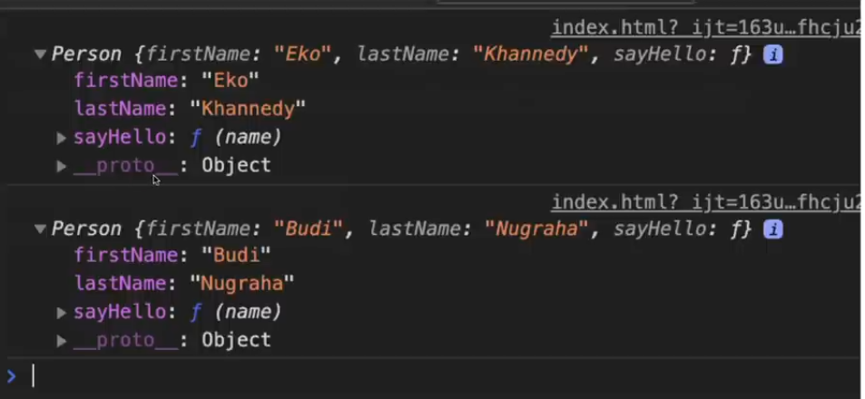

### Diagram Prototype

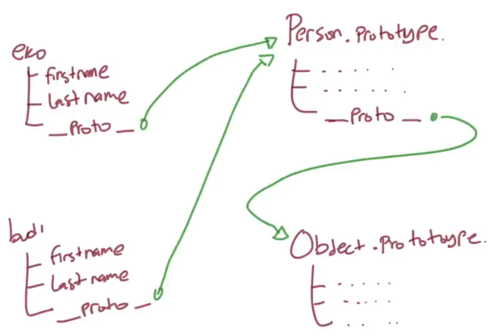

### Console : Object Instance Inheritance

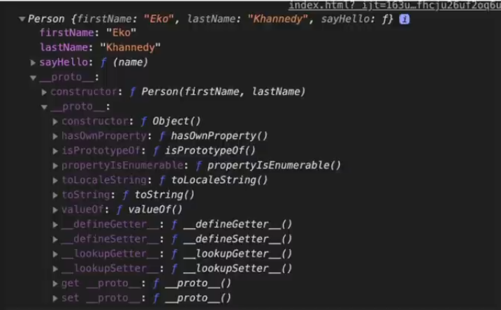

### Menambah Property ke Prototype

- Property mirip object, dimana kita bisa menambah property baik itu value ataupun method.
- Saat kita menambahkan sebuah property ke Prototype, secara otomatis, semua object instance yang turunan dari prototype tersebut akan memiliki property tersebut.

### Kode : Menambah Property ke Instance Object

```javascript
const eko = new Person("Eko", "Khanndy");

// ini hanya untuk instance object eko
eko.sayBye = function () {
  console.info("Good Bye");
}
```

### Kode : Menambahkan Property ke Prototype

```javascript
Person.prototype.sayBye = function () {
  console.info("Good Bye");
}

Person.prototype.run = function () {
  console.info(`${this.firstName} is running`);
}
```

### Cara Kerja Prototype Inheritance

- Bagaimana bisa property di prototype diakses dari object instance?
- Ketika kita mengakses property di object instance, perama akan di cek apakah di object tersebut terdapat property tersebut atau tidak, jika tidak maka akan dicek di `__proto__` (prototype) nya, jika masih ditidak ada, akan dicek lagi di `__proto__` (prototype) yang lebih tinggi, begitu seterusnya, sampai berakhir di Object Prototype.

### Console : Prototype Inheritance

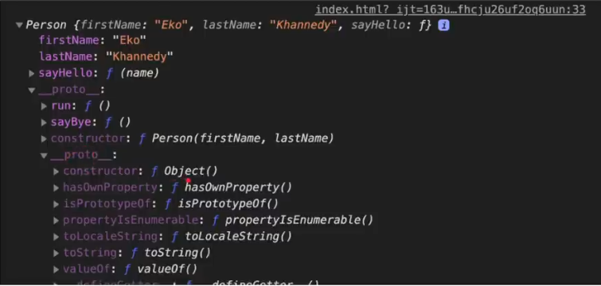

## Prototype Inheritance

- Sekarang kita sudah tahu, bahwa prototype selalu memiliki parent, artinya dia adalah turunan, parent tertinggi adalah Object prototype.
- Pertanyaannya bagaimana jika kita ingin melakukan inheritance ke Prototype lain?
- Hal ini juga bisa dilakukan, namun agak sedikit *tricky*, karena hal ini, sebenarnya untuk JavaScript modern, tidak dirokomendasikan lagi prakterk OOP menggunakan Prototype, karena ES6 sudah dikenalkan kata kunci class yang akan nanti dibahas di chapter tersendiri.

### Kode : Prototype Inheritance Salah (1)

```javascript
function Employee(name) {
  this.name = name;
}

function Manager(name) {
  this.name = name;
}
```

---

```javascript
Manager.prototype = Employee.prototype;

Manager.prototype.sayHello = function (name) {
  console.info(`Hello ${name}, my name is Manager ${this.name}`);
}

Employee.prototype.sayHello = function (name) {
  console.info(`Hello ${name}, my name is Employee ${this.name}`);
}
```

### Diagram : Prototype Inheritance Salah

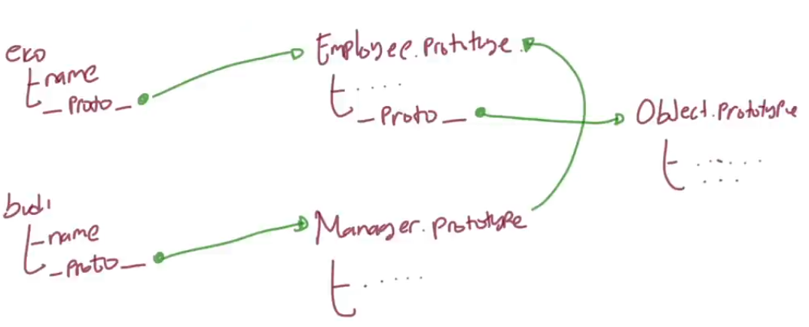

### Kode : Prototype Inheritance Benar (1)

```javascript
function Employee(name) {
  this.name = name;
}

function Manager(name) {
  this.name = name;
}
```

---

```javascript
Manager.prototype = Object.create(Employee.prototype);

Manager.prototype.sayHello = function (name) {
  console.info(`Hello ${name}, my name is Manager ${this.name}`);
}

Employee.prototype.sayHello = function (name) {
  console.info(`Hello ${name}, my name is Employee ${this.name}`);
}
```

### Diagram Prototype Inheritance Benar

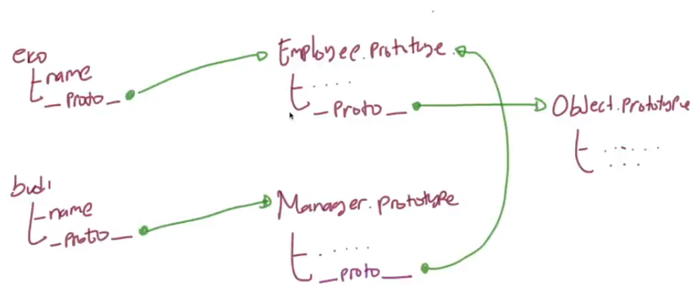

## Keyword Class

### Membuat Class

- Sejak EcmaScript versi 6, diperkenalkan kata kunci baru, yaitu class, ini merupakan kata kunci yang digunakan untuk membuat class di JavaScript.
- Dengan kata kunci ini class, kita tidak perlu lagi menggunakan constructor function untuk membuat class.

### Kode : Membuat Class

```javascript
class Person() {
  // some code
}

const eko = new Person();
console.info(eko);
```

## Constructor di Class

- Karena berbentuk constructor function mirip dengan function, jadi kita bisa menambah parameter pada constructor function, lantas bagaimana dengan class?
- Di class juga kita bisa menambahkan constructor, dimana dengan menggunakan constructor, kita juga bisa menambah parameter saat pertama kali membuat object nya.
- Untuk membuat constructor di class, kita bisa menggunakan kata kunci `constructor`.

### Kode : Constructor di Class

```javascript
class Person{
  constructor(name) {
    this.name = name;
  }
}

const eko = new Person("Eko");
console.info(eko);
```

## Property di Class

- Sama seperti pada constructor function, dalam class pun kita bisa menambahkan property.
- Karena hasil akhirya adalah sebuah object, jadi menambahkan property di class bisa juga dilakukan di instance object nya.

### Kode : Property di Class

```javascript
class Person{
  constructor(name) {
    this.name = name;
  }
}

const eko = new Person("Eko");
console.info(eko.name);
```

## Method di Class

- Membuat method di class sebenarnya bisa dilakukan dengan cara seperti menambahkan method di constructor function.
- Namun, hal tersebut sebenarnya menambahkan method ke dalamm instance object.
- Khusus untuk method sebaiknya kita menambahkan ke prototype, buka ke instance object.
- Untungnya di class, ada cara mudah menambahkan method dan secara otomatis ditambahkan ke prototype.

### Kode : Method di Class

```javascript
class Person {
  constructor (name) {
    this.name = name;
  }

  sayHello (name) {
    console.info(`Hello ${name}, my name is ${this.name}`);
  }
}
```

## Class Inheritance

- Sebelumnya kita sudah tahu bahwa prototype mendukung pewarisan, walaupun agak sedikit *tricky* cara pembuatanya.
- Untungnya itu diperbaiki  di ES6 dengan fitur class nya.
- Sebuah class bisa melakukan pewarisan dari class lainnya dengan menggunakan kata kunci `extends`.
- Di JavaScript, class inheritance sama seperti prototype inheritance, hanya bisa memiliki satu parent class.

### Kode : Class Inheritance (1)

```javascript
class Employee {
  sayHello (name) {
    console.info(`Hello ${name}, my name is Employee ${this.name}`);
  }
}

class Manager extends Employee {
  sayHello (name) {
    console.info(`Hello ${name}, my name is Manager ${this.name}`);
  }
}
```

### Kode : Class Inheritance (2)

```javascript
const budi = new Employee();
budi.name = "Budi";
budi.sayHello("Joko");

const eko = new Manager();
eko.name = "Eko";
eko.sayHello("Joko");
```

## Super Constructor

- Class inheritance sifatnya seperti Prototype inheritance.
- Bagaimana dengan Constructor inheritance? Sebenarnya Constructor Inheritance hanyalah melakukan eksekusi constructor lain dengan tujuan agar property di constructor lain bisa ditambahkan ke instance object ini.
- Dalam kasus ini, jika kita ingin mencapai hasil yang sama, kita bisa menggunakan kata kunci `super` di dalam constructor.
- Kata kunci `super` digunakan untuk memanggil constructor super class.
- Jika di child class, kita membuat constructor, maka kita wajib memanggil parent constructor, walaupun di parent tidak ada constructor.

### Kode : Super Constructor (1)

```javascript
class Employee {
  constructor(firstName) {
    this.firstName = firstName;
  }

  sayHello(name) {
    console.info(`Hello ${name}, my name is employee ${this.firstName}`);
  }
}
```

### Kode : Super Constructor (2)

```javascript
class Manager extends Employee {
  constructor (firstName, lastName) {
    super(firstName);
    this.lastName = lastName;
  }

  sayHello(name) {
    console.info(`Hello ${name}, my name is manager ${this.firstName}`);
  }
}
```

## Super Method

- Selain digunakan untuk memanggil constructor milih parent class, kata kunci `super` juga bisa digunakan untuk mengakses method parent class.
- Caranya bisa menggunakan super titik nama function nya.
- Dengan kata lain, super sebenarnya adalah reference ke parent prototype, mirip seperti `__proto__`.

### Kode : Super Method

```javascript
class Shape {
  paint() {
    console.info("Paint Shape");
  }
}

class Circle extends Shape {
  paint() {
    super.paint(); // Memanggil paint() method parent class
    console.info("Paint Circle")
  }
}
```

## Getter dan Setter di Class

- Class juga mendukung pembuatan getter dan setter.
- Perlu diingat, getter dan setter in akan berada di prototype, bukan di instance object.

### kode : Getter dan Setter

```javascript
class Person {
  constructor (firstName, lastName) {
    this.firstName = firstName;
    this.lastName = lastName;
  }

  get fullName() {
    return `${this.firstName} ${this.lastName}`;
  }

  set fullName(value) {
    const result = value.split(" ");
    this.firstName = result[0];
    this.lastName = result[1];
  }
}
```

### Console : Getter dan Setter

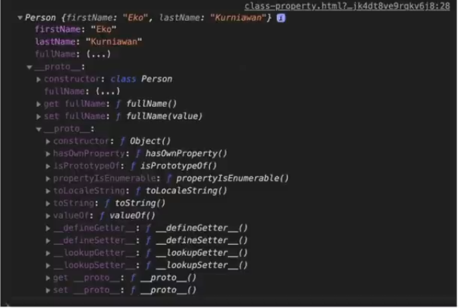

## Public Class Field

- Biasanya, saat kita ingin menambahkan field / attribute (property yang berisi value), kita biasanya tambahkan di constructor.
- Namun, ada proposal di EcmaScript yang mengajukan pembuatan *public class field* ditempakan diluar constructor, selevel dengan penempatan method.
- Proposal ini masih belum final, namun beberapa browser sudah mendukung nya.
- 

---

- Didalam proposal tersebut juga disebutkan bahwa EcmaScript akan mendukung access modifier public dan private.
- Public artinya bisa diakses dari luar class, dan private hanya bisa diakses dari dalam class saja.
- Untuk membuat Public class field, kita busa langsung buat nama field dengan value nya sesuai selevel dengan method.
- Jika kita tidak memasukan value ke dalam field tersebut, artinya field tersebut memiliki value `undefined`.

### Kode : Public Class Field

```javascript
class Customer {
  firstName;
  lastName;
  balance = 0;
}
 const eko = new Customer();
 console.info(eko);
```

### Console : Public Class Field

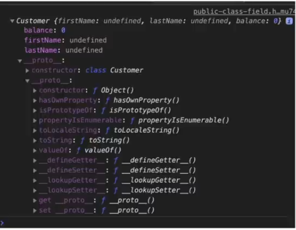

### Kode : Public Class Field dan Constructor

```javascript
class Customer {
  firstName;
  lastName;
  belance = 0;

  constructor(firstName, lastName) {
    this.firstName = firstName;
    this.lastName = lastName;
  }
}

const eko = new Customer("Eko", "Khanndy");
console.info(eko);
```

### Console : Public Class Field dan Constructor

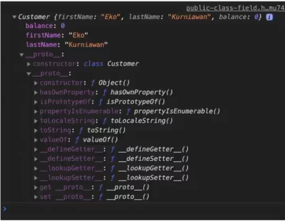

## Private Class Field

- Secara default, saat kita menambahkan field, maka field tersebut bisa diakses dari manapun.
- Jika ingin membuat field yang bersifat pribate (hanya bisa diakses di dalam class), kita bisa menggunakan tanda `#` sebelum nama field nya.
- Ini dinamakan private class field, dan hanya bisa diakses dari dalam class saja.

### Kode : Private Class Field

```javascript
class Counter {
  #counter = 0

  increnment() {
    this.#counter++;
  }

  decrement() {
    this.#counter--;
  }

  get() {
    return this.#counter;
  }
}

const counter = new Counter();
counter.increnment();
counter.increnment();

counter.increnment();
counter.increnment();

counter.increnment();
counter.increnment();

console.info(counter.get());
```

## Private Method

- Sama Seperti field, terdapat proposal juga untuk menambah fitur private method di EcmaScript.
- Dengan demikian, access modifier private juga bisa digunakan di method.
- Caranya sama dengan tanda `#` diawal method, maka secara otomatis method tersebut adalah private.
- Ingat fitur ini masih dalam tahapan, belum benar-benar menjadi standard EcmaScript, jadi mungkin tidak semua browser menduking fitur ini.
- 

### Kode : Private Method

```javascript
class Person {
  say(name) {
    if (name) {
      this.#sayWithName(name);
    }else {
      this.#sayWithoutName();
    }
  }

  #sayWithName(name) {
    console.info(`Hello ${name}`);
  }

  #sayWithoutName() {
    console.info('Hello');
  }
}

const eko = new Person();
eko.say("Budi");
```

## Operator instanceof

- Kadang ada kasus kita ingin mengecek apakah sebuah objek merupakan instance dari class tertentu atau bukan.
- Kita tidak bisa menggunakan operator `typeof`, karena object dari class, jika kita gunakan operator `typeof`, hasilnya adalah *object*.
- Operator instanceof akan menghasilkan boolean, true jika benar object tersebut adalah instance object nya, atau false jika bukan.

### Kode : Operator Instanceof

```javascript
class Employee {

}

class Manager {

}

const budi = new Employee();
const eko = new Manager();

console.info(budi instanceof Employee); // true
console.info(budi instanceof Manager); // false
console.info(budi instanceof Employee); // false
console.info(budi instanceof Manager); // true
```

### Operator instanceof di Class inheritance

- Operator instanceof mendukung class inheritance, artinya instanceof juga bisa digunakan untuk mengecek, apakah sebuah object adalah instance dari class tertentu, atau turunan dari class tertentu ?

### Kode : Operator instanceof inheritance

```javascript
class Employee {

}
class Manager extends Employee {

}

const budi = new Employee();
const eko = new Manager();

console.info(budi instanceof Employee); // true
console.info(budi instanceof Manager); // false

// true karena Manager adalah turunan dari Employee
console.info(eko instanceof Employee); // true
console.info(eko instanceof Manager); // true
```

## Kata Kunci Static

- `static` adalah kata kunci yang bisa kita tambahkan sebelum field (attribute) atau method, biasanya ketika membuat field(attribute) atau method, maka secara otomatis field(attribute) akan menjadi property di instance object, dan method akan menjadi function di prototype.
- Jika kita tambahkan `static`, maka hal itu tidak terjadi.

### Static Class Field

- Jika kita tambahkan `static` dalam class field, secara otomatis field tersebut bukan lagi milik instance object, melainkan milik class nya itu sendiri.
- Biasanya static digunakan jika ingin membuat utility field atau function.
- Cara mengakses `static` class field pun tidak lagi lewat object, melainkan lewat class nya.
- Static class field bisa diartikan sifatnya global, tidak peduli diakses dimana atau siapa yang mengakses, hasilnya akan sama.

### Kode : Static Class Field

```javascript
class Configuration {

  static name = "Belajar JavaScript Dasar";
  static version = 1.0;
  static author = "Eko Kurniawan";

}
```

### Kode : Mengakses Static Class Field

```javascript
console.info(Configuration.name);
console.info(Configuration.version);
console.info(Configuration.author);
```

## Static Method

- Kata kunci `static` juga tidak hanya ditambahkan di field tapi juga di method.
- Jika kita ditambahkan di method, artinya method tersebut jika memiliki class nya, bukan prototype.
- Dan untuk mengakses method tersebut, kita juga bisa lakukan seperti mengakses `static` class field.

### Kode : Static Method

```javascript
class MathUtil {

  static sun(...numbers) {
    let total = 0;
    for (const number of numbers){
      total += number;
    }
    return total;
  }
}

const sum = MathUtil.sum(1, 2, 3, 4, 5, 6, 7);
console.info(sum);
```

## Error

- Saat membuat aplikasi, sudah tentu kita tidak akan terhindar dari yang namanya error.
- Di JavaScript, Error merupakan suatu yang sudah standard.
- Banyak sekali class error di JavaScript, namun sema class error di JavaScript selalu berujung di class Error, artinya class Error adalah superclass untuk semua jenis error di JavaScript.
- Contoh class error yang terdapat di JavaScript contohnya `SyntaxError`, `EvalError`, dan lain-lain
- 

### Throw Error

- Saat kita membuat instance object dari class Error, tidak lantas otomatis terjadi error.
- Kita perlu memberitahu program kuta, bahwa kita akan mentrigger sebuah error terjadi, atau istilahnya adalah melempar error `throw error`.
- Untuk melempar error, kita bisa gunakan kata kunci `throw`, diikuti dengan instance object error nya.
- Jika terjadi error, maka otomatis kode program kita akan terhenti, dan kita bisa melihat detail errornya di console browser kita.

### Kode : Throw Error

```javascript
class MathUtil {

  static sun(...numbers) {
    if (numbers.length === 0) {
      throw new Error("Total parameter harus lebih dari 0");
    }


    let total = 0;
    for (const number of numbers){
      total += number;
    }
    return total;
  }
}

const sum = MathUtil.sum(1, 2, 3, 4, 5, 6, 7);
console.info(sum);
```

## Error Handling

- Saat terjadi error di kode program JavaScript, kadang kita tidak ingin program kita berhenti.
- Di JavaScript, kita bisa menangkap jika terjadi error.
- Kita bisa menggunakan `try catch` statement untuk menangkap error.
- Pada block `try`, kita akan mencoba mengakses kode program yang bisa menyebabkan error, dan jika terjadi error, block `try` akan berhenti dan otomatis masuk ke block `catch`.
- Jika tidak terjadi error, block catch tidak akan dieksekusi.

### Kode : Error Handling

```javascript
try {
  console.info(MathUtil.sum());
  console.info("Kode Block try akan berhenti");
} catch {
  console.error(`Terjadi Error : ${error.message}`)
}

console.info("Kode Program Tidak akan berhenti");
```

## Kata Kunci Finally

- Kadang kita ingin melakukan sesuatu entah itu terjadi error atau tidak.
- Dalam `try catch`, kita bisa menambahkan block `finally`.
- Block `finally` ini akan selalu dieksekusi setelah `try catch`, entah terjadi error atau tidak, block `finally` akan dieksekusi.

### Kode : Kata Kunci finally

```javascript
try {
  console.info(MathUtil.sum());
  console.info("Kode Block ini tidak akan tereksekusi");
} catch (e) {
  console.error(`Terjadi Error : ${e.message}`);
} finally {
  console.info("Kode Program Selesai");
}
```

## Try Finally

- Kata kunci `finally` juga bisa digunakan tanpa perlu menggunakan `catch`
- Biasanya ini digunakan dalam kasus tertentu

## Kode : Try Finally

```javascript
class Counter {
  #counter = 1; 

  next() {
    try {
      return this.#counter;
    } finally {
      this.#counter++;
    }
  }
}

const counter = new Counter();
console.info(counter.next());
console.info(counter.next()); 
console.info(counter.next());
console.info(counter.next());
console.info(counter.next());
```

## Membuat Class Error Manual

- Walaupun JavaScript sudah memiliki standard class Error
- Namun alangkah baiknyam kita membedakan tiap jenis error.
- Untuk membuat error kita sendiri secara manual sangatlah mudah, cukup membuat class turunan dari class Error.
- Dan jangan lupa tambahkan parameter message, agar bisa dikirimkan ke parameter di constructor class Error.

### Kode : Class ValidationError

```javascript
class ValidationError extends Error {
  constructor(message, field) {
    super(message);
    this.field = field;
  }
}
```

### Kode : Menggunakan ValidationError

```javascript
class MathUtil {
  static sum(...numbers) {
    if (numbers.length === 0) {
      throw new ValidationError('Total Parameter harus lebih dari 0, ', 'numbers');
    }

    let result = 0;
    for (const number of numbers) {
      result += number;
    }
    return result;
  }
}
```

## Iterable dan Iterator

- Salah satu fitur terbaru di ES6 adalah iterable.
- Iterable adalah sepecial object yang memiliki standarisasi.
- Dengan mengikuti menggunakan perulangan `for...of`.
- Contoh yang sudah menggunakan standarisasi iterable adalah string, Array, Object, dan lain-lain

### Kode : Kontrak Iterable (dalam TypeScript)

```typescript
interface Iterable<T> {
  [Symbol.iterator](): Iterator<T>;
}
```

## Kode : Kontrak Iterator (dalam TypeScript)

```typescript
interface Iterator<T, TReturn = any, TNext = undefined> {
  // Note 'next' is defined using a tuple to ensure we report the correct assignment
  next(...args: [] | [TNext]):IteratorResult<T, TReturn>;
  return?(value?: TReturn): IteratorResult<T, TReturn>;
  throw?(e? : any): IteratorResult<T, TReturn>;
}
```

## Kode : Kontrak Iterator Result (dalam TypeScript)

```typescript
interface IteratorYeildResult<TYield> {
  done? : false;
  value : TYield;
}

interface IteratorReturnResult<TReturn> {
  done : true;
  value : TReturn;
}

type IteratorResult<T, TReturn = any> = IteratorYeildResult<T> | IteratorReturnResult<TReturn>;
```

### Cara Kerja Iterable dan Iterator

- Jika kita mengikuti kontrak iterable, maka object yang kita buat akan bisa dilakukan iterasi menggunakan `for...of`.
- Setiap kuta melakukan perulangan, object iterator akan dibuat.
- Hal ini menjadi aman jika kita melakukan iterasi berulang ulang, katena iterator baru akan dibuat terus menerus.

### Kode : Membuat Counter Iterator Result

```javascript
class CounterIteratorResult {
  constructor(value, done) {
    this.value = value;
    this.done = done;
  }
}
```

## Kode : Membuat Counter Iterator

```javascript
class CounterIterator {
  constructor(value, max) {
    this.value = value;
    this.max = max;
  }

  next() {
    try {
      if (this.value > this.max) {
        return new CounterIteratorResult(this.value, true);
      } else {
        return new CounterIteratorResult(this.value, false);
      }
    } finally {
      this.value++;
    }
  }
}
```

### Kode : Membuat Counter Iterable

```javascript
class Counter {
  constructor(value, max) {
    this.value = value;
    this.max = max;
  }

  [Symbol.iterator]() {
    return new CounterIterator(this.value, this.max);
  }
}
```

### Kode : Menggunakan Counter Iterable

```javascript
const counter = new Counter(1, 10);
for (const element of counter){
  console.info(element);
}
```

## Materi Selanjutnya

- JavaScript Standard Library
- JavaScript Modules
- JavaScript Document Object Model
- JavaScript Asunc
- JavaScript Web API
