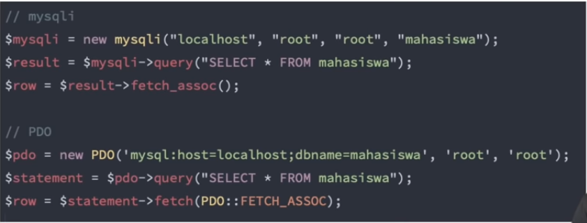
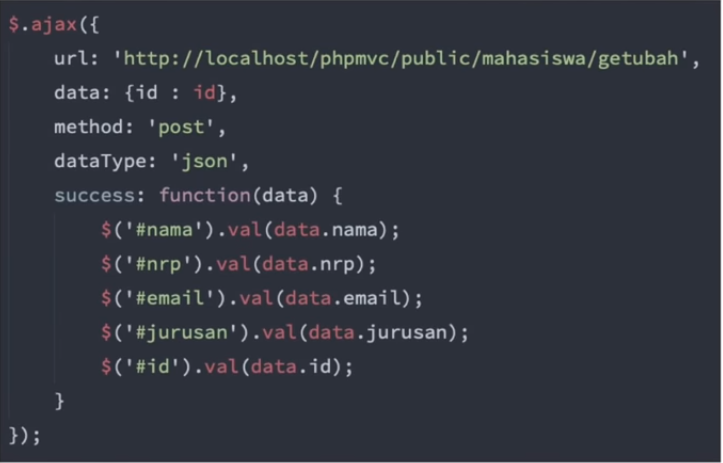

# Apa itu API

> Api (Application Programming Interface) adalah sekumpulan fungsi, subroutine, protokol komunikasi, atau kakas/tools untuk membuat perangkat lunak.

- Antarmuka yang berupa kumpulan yang dapat dipanggil atau dijalankan oleh program lain.
- Penerapannya sangat luas
  - Bahasa Pemrograman
  - Library & Framework
  - Sistem Operasi
  - Web API / Web Service

## Apa itu Interface / antarmuka

> Bagian yang sama antara dua atau lebih komponen terpisah pada sebuah sistem komputer.

## Bahasa Pemrograman

Koneksi ke database MySQL menggunakan 2 API yang berbeda di Bahasa pemrograman PHP

## Library & Framework

API JQuery untuk menggambil data menggunakan ajax

## Sistem Operasi

- Windows API
  - Base Service : `kernel.dll`
  - Graphic Device Interface : `win32k.sys`
  - User Interface : `user32.dll`
- iOS API
  - Contact : `CNMutableContact()`
  - Camera : `AVCaptureDevice()`
- Android API
  - Contact : `ContactsContract.RawContacts`

## Web API / Web Service

- SOAP (Simple Object Access Protocol)
- REST (REpresentational State Transfer)

## Apa yang akan dipelajari

- Apa itu REST API ?
- JSON
  - membuat & mengakses
- Public API
  - simple/complex auth
- Membuat REST Server

## Pre-requisite

- Javascript Dasar
- Object
- DOM (Document Object Model)
- PHP Dasar
- Codeigniter

## Apa yang harus disiapkan

- Code Editor
  - neovim
- Web Server
  - XAMPP
- Web Browser
  - Firefox
- API Testing Tools
  - Postman
